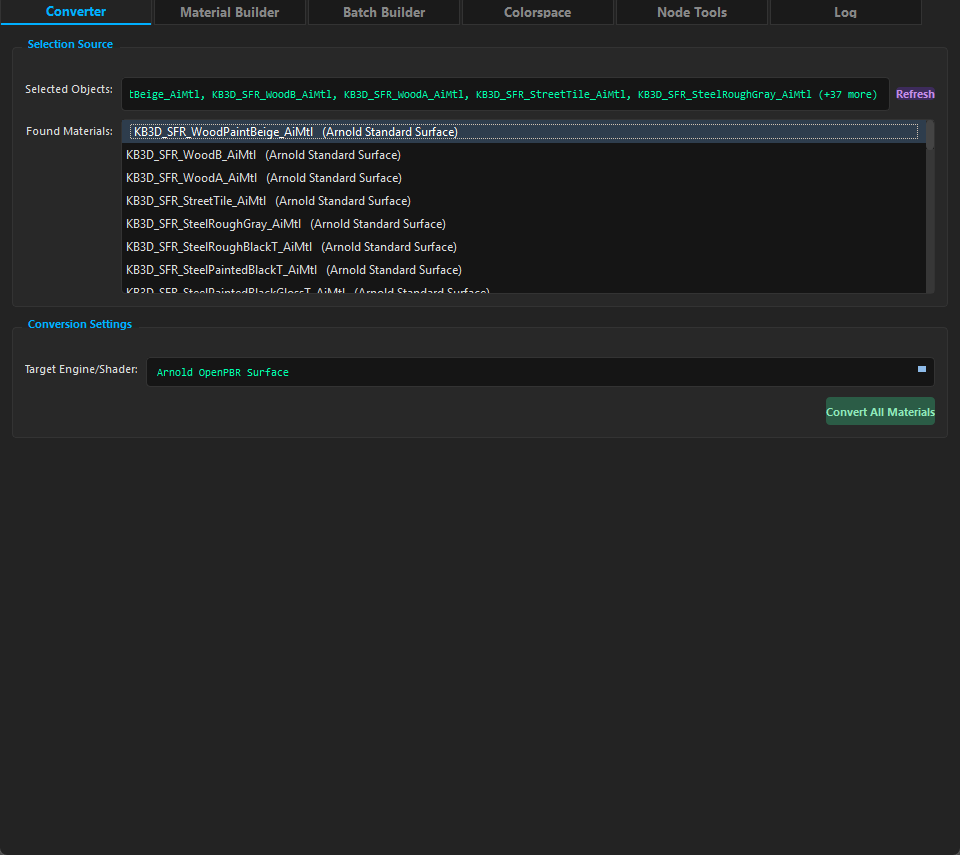
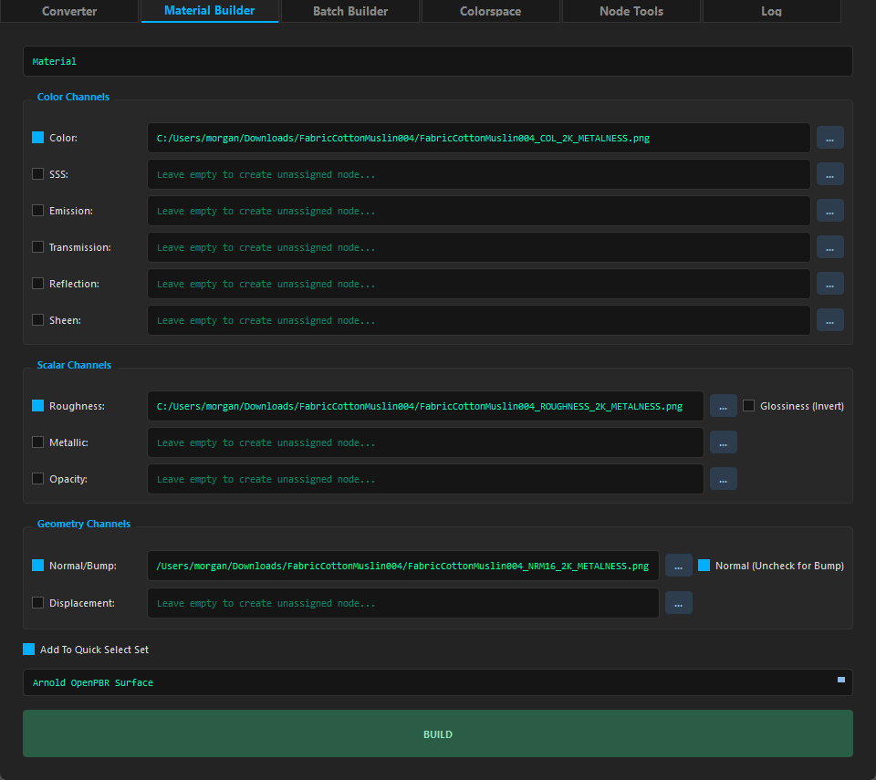
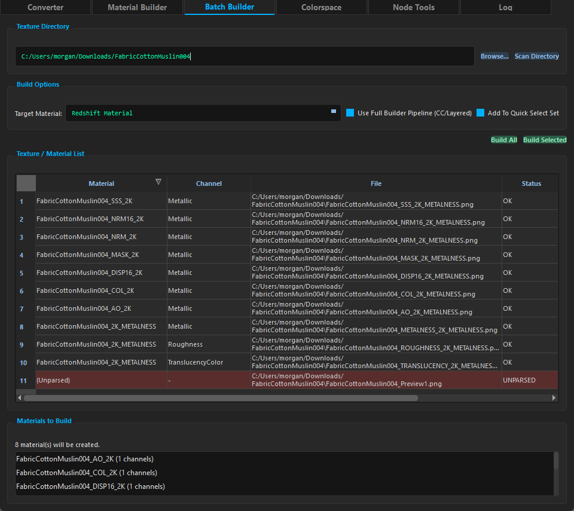
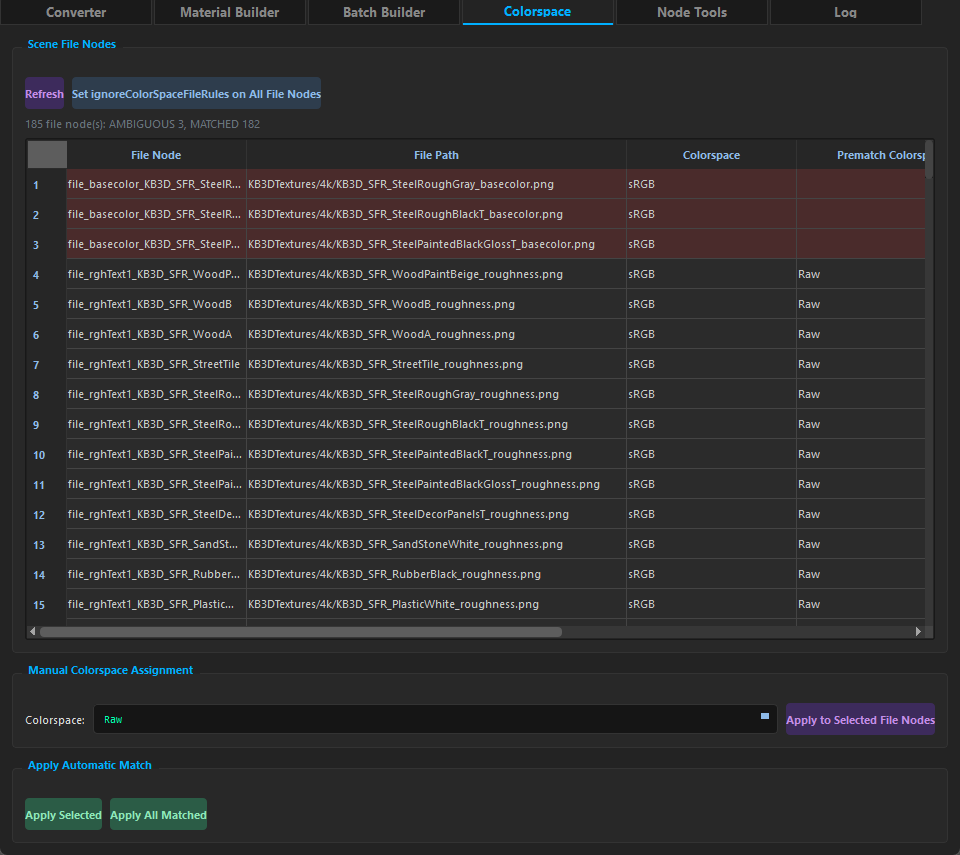
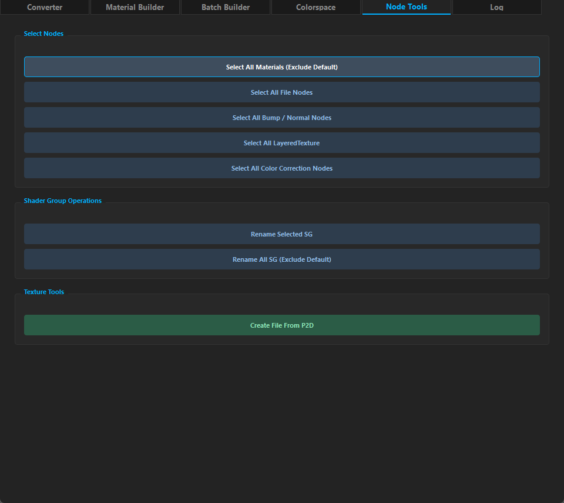
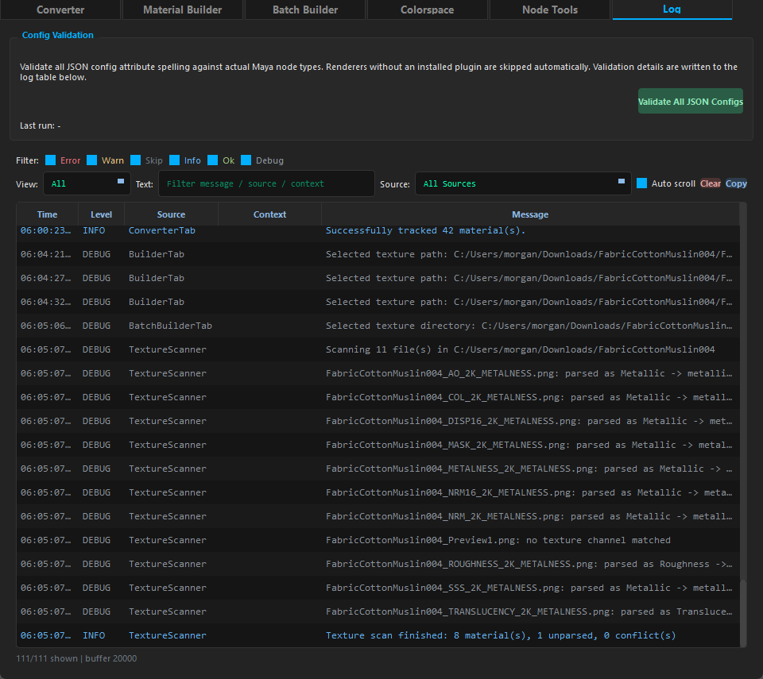

# PBR Material Converter

[English](../README.md) | **简体中文**

**转换规格说明：** [简体中文](CONVERSION_SPEC_zh.md) | [English](CONVERSION_SPEC.md)

**渲染器 JSON 配置指南：** [简体中文](CONFIG_GUIDE_zh.md) | [English](CONFIG_GUIDE.md)

Maya 工具包，支持 Arnold / Redshift / V-Ray 之间的 PBR 材质转换、构建和场景管理。

## 安装

将 `materialConvert` 文件夹放到任意位置，在 Maya 中建一个 Shelf 按钮粘贴以下 3 行（把路径换成你的实际路径）：

**方式一：复制到 Maya scripts 目录（推荐）**

```python
import sys
sys.path.insert(0, r"C:\Users\<用户名>\Documents\maya\<版本>\scripts\materialConvert")
exec(open(r"C:\Users\<用户名>\Documents\maya\<版本>\scripts\materialConvert\main.py").read())
```

**方式二：放在任意目录**

```python
import sys
sys.path.insert(0, r"你的路径\materialConvert")
exec(open(r"你的路径\materialConvert\main.py").read())
```

**方式三：使用 bat 文件（最简单）**

双击运行 `copy_launch.bat`，启动命令会自动复制到剪贴板，直接在 Maya Script Editor 中粘贴即可。

**支持版本**: Maya 2024+
**依赖**: 无（零外部依赖，纯 `maya.cmds` API）

## 功能

### Material Converter



- 在 Arnold / Redshift / V-Ray 间批量转换 PBR 材质
- 自动识别材质类型，一键全部转换
- 支持 bump/normal 节点、颜色校正节点、置换节点的连带转换
- 批量转换带进度条，支持单步撤销（Ctrl+Z）
- 支持 6 种材质类型：`aiStandardSurface` / `aiOpenPBRSurface` / `RedshiftMaterial` / `RedshiftOpenPBRMaterial` / `RedshiftStandardMaterial` / `VRayMtl`

### Material Builder



- 从纹理路径一键构建完整 PBR 材质
- 支持 Color / Roughness / Glossiness（自动反相）/ Metallic / Normal / Bump / Displacement / Opacity / Transmission / Reflection / Sheen / SSS / Emission 通道
- SSS 通道支持（colorCorrect + layeredTexture + ramp）
- 置换节点链支持
- 材质类型下拉框由 `config/material/*.json` 驱动——新增材质自动出现
- 可选"加入快速选择集"开关

### Batch Builder



- 选择目录并自动按文件名解析 PBR 贴图（规则参考 `config/texture_channels.json`）
- 将贴图分组为材质，并预览将要创建的材质列表（Materials to Build）
- 已解析通道与未解析文件合并展示在同一个表格，Status 列支持排序
- 批量构建全部 / 选中材质到任意支持的渲染器
- 可切换完整 Builder 流程（colorCorrect + layeredTexture + ramp）或简单直连
- 支持 BaseColor / Roughness / Glossiness（自动反相）/ Metallic / Normal / Bump / Displacement / Opacity / Transmission / Reflection / Sheen / SSS（Translucency + Scattering）/ Emission

### Colorspace



- 独立 **Colorspace** 标签页——file 节点色彩空间操作的**唯一 UI 入口**（Node Tools 不再提供任何 colorspace UI）
- **File Node List**：扫描场景全部 `file` 节点为可排序表格（File Node / File Path / Colorspace / Prematch Colorspace / Diagnostic）；Diagnostic 列承载匹配状态（如 `CONFLICT: ...`）并按问题严重度排序而非字母序
- **Refresh**：对每个 file 节点评估自动匹配，**不修改 scene**
- **自动匹配** 由两个 driver 驱动：**Name Driver**（文件名关键词来自 `config/texture_channels.json`）与 **Channel Driver**（BFS 追踪全部下游连接，匹配 `commonAttributeRoles` + `config/material/*.json` 扩展的属性关键词）；最终状态 `MATCHED` / `CONFLICT` / `AMBIGUOUS` / `UNMATCHED` / `INVALID`
- **Apply Selected** / **Apply All Matched**：仅将 `MATCHED` 结果应用到 `file.colorSpace`（单步 undo chunk）；`CONFLICT` / `AMBIGUOUS` / `UNMATCHED` / `INVALID` 一律不自动应用
- **Manual Colorspace Assignment**：从 Maya 实际可用的 input spaces 中选择并只应用到选中行——不修改匹配规则或配置
- 选中行会同步 Maya 选择到对应 file 节点；工具按钮可对所有 file 节点设置 `ignoreColorSpaceFileRules`

### Node Tools



- **Select Nodes**：按类型批量选择（材质/文件/bump/layeredTexture/CC），排除默认材质
- **Rename Shading Engine**：批量重命名 SG 以匹配材质名称
- **Create File From P2D**：从选中的 place2dTexture 创建 file 节点，复制 2D 变换属性与 UV/Filter 连接

### Log



- 全局结构化日志查看器，支持按级别、来源和文本过滤
- 面板顶部提供 Config Validation，可在 Maya 中校验全部 JSON 配置的拼写（材质 / `bumpNormal.json` / `colorCorrection.json`）
- 创建临时节点校验 `node_type` 与每个映射属性（含 prerequisites 与 displacement），结束后自动清理
- 未安装插件的渲染器尽可能自动加载，加载失败则整组跳过（绝不误报为拼写错误）

## 架构

### 数据流
```
源材质 → [源 JSON 配置] → 通用格式 → [目标 JSON 配置] → 目标材质
```

### 核心设计原则
- **配置驱动**：所有渲染器映射定义在 JSON 文件中，Python 代码中零硬编码属性名
- **CC 节点类型配置驱动**：颜色校正节点识别直接读取 `config/colorCorrection.json` 定义的节点类型；新增已配置的 CC 节点类型无需维护 Python 类型列表
- **易于扩展**：新增渲染器支持 = 在 `config/material/` 添加 JSON 文件，无需改代码
- **模块化转换器**：4 个独立模块分别处理属性传递、凹凸/法线、颜色校正、置换
- **统一导入**：PySide 版本探测集中在 `ui/__init__.py`
- **可共存的启动**：项目根置顶 `sys.path`，并释放其它扁平结构工具占用的同名顶层包（`core` / `ui` / `main`）及其缓存的子模块——"后启动者赢"，且不影响对方已打开的窗口
- **日志系统**：统一结构化 Logger（ERROR/WARN/SKIP/INFO/DEBUG/OK）+ 环形缓冲；Log 标签页仅在可见时通过单消费者 `drain()` 镜像同步缓冲区，已淘汰的行同步从表格移除。带节点的日志可右键 `Select Node(s)` 直接选择对应节点。Logger 与 UI 模型最多各保留 `DEFAULT_MAX_RECORDS`（20,000）条记录

## 项目结构

```
materialConvert/
├── config/                          # JSON 配置文件
│   ├── material/                    # 渲染器材质属性映射
│   │   ├── common.json              # 通用 PBR 参数及颜色-权重关系
│   │   ├── aiStandardSurface.json
│   │   ├── aiOpenPBRSurface.json
│   │   ├── RedshiftMaterial.json
│   │   ├── RedshiftOpenPBRMaterial.json
│   │   ├── RedshiftStandardMaterial.json
│   │   └── VRayMtl.json
│   ├── bumpNormal.json              # 凹凸/法线节点映射（input/output 统一 schema）
│   ├── colorCorrection.json         # 颜色校正节点映射
│   ├── colorSpace.json              # 色彩空间自动匹配规则
│   ├── texture_channels.json        # Batch Builder 文件名→通道规则
│   └── builder_naming.json          # Material Builder 命名约定
├── core/                            # 核心引擎
│   ├── converter.py                 # MaterialConverter 调度器
│   ├── results.py                   # ConversionResult / BuildResult 结果模型
│   ├── converters/                  # 业务转换模块
│   │   ├── attribute.py             # 属性收集与传递
│   │   ├── bump.py                  # 凹凸/法线转换
│   │   ├── cc.py                    # 颜色校正转换
│   │   └── displacement.py          # 置换转换
│   ├── config_loader.py             # JSON 配置解析
│   ├── module_reload.py             # 重载时按物理路径清理本项目模块
│   ├── node_utils.py                # Maya 节点工具函数
│   ├── prerequisites.py             # 渲染器前提条件处理
│   ├── logger.py                    # 统一日志模块
│   ├── builder_context.py           # Material Builder 共享状态
│   ├── texture_scanner.py           # 目录扫描 / 文件名→通道解析
│   ├── batch_builder.py             # 批量构建编排
│   ├── material_builder.py          # Material Builder 核心逻辑
│   ├── colorspace.py                # 色彩空间匹配核心（name/channel driver + resolver + matcher）
│   └── config_validator.py          # JSON 配置校验（Log 标签页）
├── ui/                              # 用户界面
│   ├── main_window.py               # 主窗口 (QMainWindow + QTabWidget)
│   ├── feedback.py                  # best-effort 操作反馈装饰器
│   ├── log_panel.py                 # 嵌入式全局日志查看器（拉取、过滤、QTableView）
│   ├── styles.py                    # QSS 暗色主题
│   ├── widgets.py                   # 目标材质下拉框共用填充
│   └── tabs/                        # 六个功能标签页
│       ├── converter_tab.py         # 材质转换
│       ├── builder_tab.py           # Material Builder
│       ├── batch_builder_tab.py     # Batch Builder
│       ├── colorspace_tab.py        # Colorspace（file 节点色彩空间管理）
│       ├── node_tools_tab.py        # Node Tools
│       └── log_tab.py               # Log（全局日志查看器 + 配置校验）
├── docs/                            # 文档
│   ├── AGENTS.md                    # AI Agent 开发指南
│   ├── CONVERSION_SPEC.md           # 转换规格说明（英文）
│   ├── CONVERSION_SPEC_zh.md        # 转换规格说明（中文）
│   ├── CONFIG_GUIDE.md              # 渲染器 JSON 配置编写指南（英文）
│   ├── CONFIG_GUIDE_zh.md           # 渲染器 JSON 配置编写指南（中文）
│   ├── images/                      # README 预览截图（每页一张）
│   └── README_zh.md                 # 本文件
├── scripts/                         # 仓库维护脚本
│   └── check_no_silent_pass.py      # CI 守卫：core/ui 禁止静默 except/print
├── tests/                           # 纯 Python 单元测试（无需 Maya）
├── .github/
│   └── workflows/test.yml           # CI：pytest + 守卫脚本（Python 3.11 + PySide6）
├── main.py                          # 入口脚本
├── copy_launch.bat                  # 双击复制启动命令
├── LICENSE
├── CHANGELOG.md                     # 变更日志
└── CHANGELOG_zh.md                  # 中文版更新日志
```

## 文档

- [CONVERSION_SPEC.md](CONVERSION_SPEC.md) — 转换规格说明（英文）
- [CONVERSION_SPEC_zh.md](CONVERSION_SPEC_zh.md) — 转换规格说明（中文）
- [CONFIG_GUIDE.md](CONFIG_GUIDE.md) — 渲染器 JSON 配置编写指南（英文）
- [CONFIG_GUIDE_zh.md](CONFIG_GUIDE_zh.md) — 渲染器 JSON 配置编写指南（中文）

## 开发

- 纯 Python 测试（无需 Maya）：`python -m pytest tests/ -v`
- CI（`.github/workflows/test.yml`）在 Python 3.11 + PySide6 下运行同一套 pytest 与 `scripts/check_no_silent_pass.py` 守卫脚本

## License

MIT
